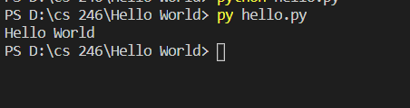

## Overview
This is my first program on GitHub and my first in Python, a simple program that prints "Hello World".

### Enviorment:
I used visual studio code with python and git downloaded

##### Running the Program:
I simpy inputed "python hello.py" into the terminal and it displaye the results.

##### Screenshot:

